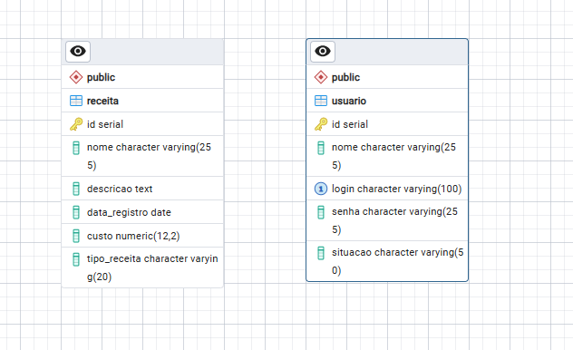

<div align="center">

# Documentação Detalhada da Aplicação e Publicação

**Aluna:** Kelli M Gutterres  

*Protótipo **Receitas GC** — Node.js, Express e PostgreSQL*

[](https://nodejs.org/)
[](https://expressjs.com/)
[](https://www.postgresql.org/)

</div>

---

## Índice

1. [Visão geral](#1-visão-geral)
2. [Estrutura do código](#2-estrutura-do-código)
3. [Modelagem do banco de dados](#3-modelagem-do-banco-de-dados)
4. [Interface desenvolvida](#4-interface-desenvolvida)
5. [Publicação na VM](#5-publicação-na-vm)
6. [URL de acesso](#6-url-de-acesso)
7. [Estimativa de tempo](#7-estimativa-de-tempo)
8. [Execução local rápida](#8-execução-local-rápida)

---

## 1. Visão geral

Aplicação web para **cadastro e gestão de receitas** (doces e salgadas), com **autenticação de usuário** e **CRUD** (criar, listar, editar e excluir receitas). O backend utiliza **Node.js** com o framework **Express**; as telas são geradas no servidor com **EJS** e estilizadas com **CSS**. Os dados ficam no **PostgreSQL**, com conexão via pool (`pg`).

**Repositório público:** [github.com/KelliGutterres/ReceitasGC](https://github.com/KelliGutterres/ReceitasGC.git)

---

## 2. Estrutura do código

A aplicação foi desenvolvida em **Node.js** com **Express**. O código principal foi organizado em **dois módulos centrais** (papéis equivalentes aos antigos *servidor* e *manipulação de dados*):

| # | Arquivo | Papel |
|---|---------|--------|
| **1** | **`server.js`** | **Servidor e configuração:** cria o app Express, define middlewares (parser de formulário, sessão, arquivos estáticos), rotas de **login/logout**, rotas **CRUD de receitas** e renderização das views **EJS**. É o ponto de entrada (`npm start` → `node server.js`). |
| **2** | **`db/pool.js`** | **Camada de acesso ao banco:** exporta um **Pool** do driver `pg` com os parâmetros de conexão ao PostgreSQL (host, porta, usuário, senha, nome do banco). As consultas SQL são executadas a partir do `server.js` usando esse pool. |

---

## 3. Modelagem do banco de dados

O banco de dados utilizado é o **PostgreSQL**, no schema **`public`**, com **duas tabelas** principais.

### 3.1 Tabela `receita`

| Coluna | Tipo | Descrição |
|--------|------|-----------|
| `id` | `serial` (PK) | Identificador único |
| `nome` | `varchar(255)` | Nome da receita |
| `descricao` | `text` | Descrição / modo de preparo |
| `data_registro` | `date` | Data de registro |
| `custo` | `numeric(12,2)` | Custo |
| `tipo_receita` | `varchar(20)` | `doce` ou `salgada` (restrição no schema) |

### 3.2 Tabela `usuario`

| Coluna | Tipo | Descrição |
|--------|------|-----------|
| `id` | `serial` (PK) | Identificador único |
| `nome` | `varchar(255)` | Nome do usuário |
| `login` | `varchar(100)` | Login (único) |
| `senha` | `varchar(255)` | Senha (armazenada com hash bcrypt) |
| `situacao` | `varchar(50)` | Situação da conta (ex.: `ativo`) |

### 3.3 Diagrama (modelagem no PostgreSQL)

A figura abaixo corresponde à modelagem visual das tabelas **`receita`** e **`usuario`** no banco.

<p align="center">
  
</p>

<p align="center"><em>Figura 1 — Esquema das entidades <strong>receita</strong> e <strong>usuario</strong>.</em></p>

---

## 4. Interface desenvolvida

### Páginas principais

| Página | Função |
|--------|--------|
| **Login** (`/login`) | Formulário de **login** e **senha**; após autenticação, redireciona para a área logada. |
| **Listagem de receitas** (`/receitas`) | Tabela com **nome**, **tipo** (doce/salgada), **data**, **custo**, **descrição** e **ações** (editar / excluir). |
| **Nova receita** (`/receitas/nova`) | Formulário para **cadastrar** receita. |
| **Editar receita** (`/receitas/:id/editar`) | Formulário para **alterar** uma receita existente. |

A **barra superior** permite navegar entre **Listagem**, **Nova receita** e **Sair** (logout). A exclusão solicita **confirmação** no navegador antes de enviar o formulário.

---

## 5. Publicação na VM

Ambiente utilizado: **Ubuntu** na VM, acesso remoto via **SSH**. Abaixo estão os passos e os **comandos** para execução.

### 5.1 Acesso à VM (SSH)

O protocolo **SSH** permite terminal remoto na VM. O endereço é o **IP ou hostname** da máquina

```bash
ssh univates@177.44.248.35
```

| Parte | Significado |
|-------|-------------|
| `ssh` | Cliente SSH: abre sessão remota segura. |
| `univates` | **Usuário** Linux na VM. |
| `177.44.248.35` | **Endereço IP** público da VM. |

### 5.2 Instalação de ferramentas na VM

#### Atualização de pacotes

```bash
sudo apt update
```

Atualiza a lista de pacotes dos repositórios configurados.

```bash
sudo apt upgrade -y
```

#### Node.js e npm

```bash
sudo apt install -y nodejs npm
```

Instala o **Node.js** e o **npm** a partir dos repositórios. Verifique as versões:

```bash
node -v
npm -v
```

#### PostgreSQL

```bash
sudo apt install -y postgresql postgresql-contrib
```

Instala o servidor **PostgreSQL** e utilitários. Serviço típico:

```bash
sudo systemctl start postgresql
sudo systemctl enable postgresql
```

#### Banco e credenciais (alinhado ao `db/pool.js`)

```bash
sudo -u postgres psql -c "CREATE DATABASE projetoreceitas_db;"
```

### 5.3 Criação das tabelas e dados iniciais

As tabelas **`usuario`** e **`receita`** usa **`db/schema.sql`**. Na pasta do projeto, após instalar dependências:

```bash
npm install
npm run db:init
npm run db:seed
```

| Comando | O que faz |
|---------|-----------|
| `npm install` | Baixa **Express**, **pg**, **ejs**, **bcryptjs**, etc. |
| `npm run db:init` | Executa `scripts/init-db.js`, que aplica **`db/schema.sql`** no banco configurado no pool. |
| `npm run db:seed` | Executa `scripts/seed-all.js`, aplicando **`db/seed_receitas.sql`** (10 receitas) e **`db/seed_usuario.sql`** (usuário padrão). |

### 5.4 Transferência do código e execução

**Código na VM** obtido clonando o repositório público:

```bash
cd ~
git clone https://github.com/KelliGutterres/ReceitasGC.git
cd ReceitasGC
```

Depois execute: `npm install`, `npm run db:init`, `npm run db:seed` (conforme acima).

**Subir o servidor**:

```bash
PORT=3000 npm start
```

Saída esperada: `Servidor em http://0.0.0.0:3000` — o processo fica em primeiro plano até `Ctrl+C`.

**Firewall (necessário):**

```bash
sudo ufw allow 3000/tcp
sudo ufw reload
```

---

## 6. URL de acesso

A aplicação foi publicada de forma acessível **pela rede** usando o **IP público** da VM e a **porta** do Node.

| Descrição | URL |
|-----------|-----|
| **Tela de login (acesso externo)** | [http://177.44.248.35:3000/login](http://177.44.248.35:3000/login) |
| **Após login, área de receitas** | [http://177.44.248.35:3000/receitas](http://177.44.248.35:3000/receitas) |

> **Nota:** `http://127.0.0.1:3000` só funciona **dentro da própria VM**. De outro computador, use **`http://177.44.248.35:3000`**.

**Credencial padrão (seed):** login `admin` / senha `senha123` — altere em ambiente real.

---

## 7. Estimativa de tempo

| Fase | Tempo | Conteúdo |
|------|-------|----------|
| **Desenvolvimento da aplicação** | **60 min** | Backend com Express, integração com PostgreSQL, telas EJS/HTML/CSS, CRUD de receitas, login com sessão, testes locais. |
| **Criação do ambiente na VM** | **15 min** | Acesso SSH, instalação de Node.js, PostgreSQL, criação do banco e execução dos scripts. |
| **Publicação na VM** | **15 min** | `git clone`, dependências, seeds, `npm start`, liberação de porta e teste pelo IP público. |

---

## 8. Execução local rápida

Pré-requisitos: **Node.js 18+** e **PostgreSQL** com banco `projetoreceitas_db` e credenciais coerentes com `db/pool.js`.

```bash
git clone https://github.com/KelliGutterres/ReceitasGC.git
cd ReceitasGC
npm install
npm run db:init
npm run db:seed
npm start
```

Acesse: **http://localhost:3000**

Variáveis opcionais: `PORT`, `HOST` (padrão `0.0.0.0`), `SESSION_SECRET` (recomendado em produção).

---

<div align="center">

*Documento gerado para entrega acadêmica — Receitas GC.*

</div>
