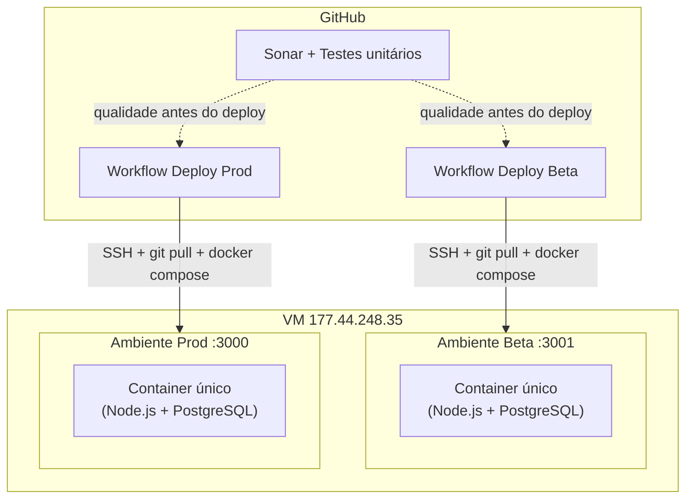
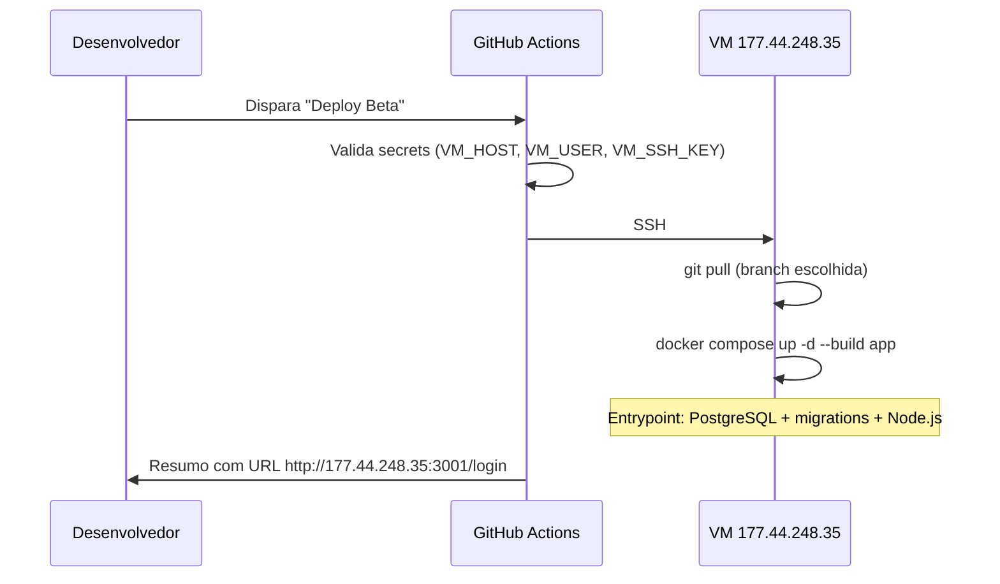
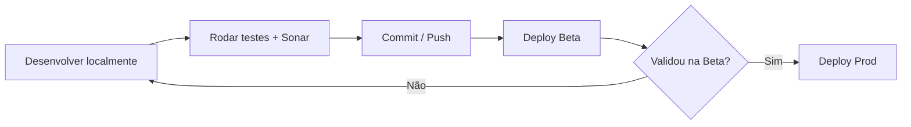

# Pipeline de Deploy — Receitas GC

Documento de referência para o trabalho de pipeline: ambientes **Beta** e **Produção** na VM universitária, com **Docker** e deploy automatizado via **GitHub Actions**.

**VM:** `177.44.248.35`  
**Usuário SSH:** `univates` (conforme documentação do projeto)

---

## Índice

1. [Visão geral da arquitetura](#1-visão-geral-da-arquitetura)
2. [Parte 1 — Preparar a VM com Docker](#2-parte-1--preparar-a-vm-com-docker)
3. [Parte 2 — Workflows de Deploy no GitHub Actions](#3-parte-2--workflows-de-deploy-no-github-actions)
4. [Sistema de migrations de banco](#4-sistema-de-migrations-de-banco)
5. [Estrutura de arquivos criados](#5-estrutura-de-arquivos-criados)
6. [Operação do dia a dia](#6-operação-do-dia-a-dia)
7. [URLs de acesso](#7-urls-de-acesso)
8. [Troubleshooting](#8-troubleshooting)

---

## 1. Visão geral da arquitetura



| Ambiente | Porta externa | Persistência de dados | Compose |
|----------|---------------|----------------------|---------|
| **Beta** | `3001` | Volume `beta_pg_data` | `docker/docker-compose.beta.yml` |
| **Produção** | `3000` | Volume `prod_pg_data` | `docker/docker-compose.prod.yml` |

Cada ambiente tem **um único container** que roda a aplicação Node.js e o PostgreSQL juntos. Os dados do banco ficam no volume Docker, separados entre Beta e Prod.

---

## 2. Parte 1 — Preparar a VM com Docker

### 2.1 Acesso SSH

```bash
ssh univates@177.44.248.35
```

### 2.2 Instalação automática (recomendado)

Após clonar o repositório na VM, execute o script de setup:

```bash
git clone https://github.com/KelliGutterres/ReceitasGC.git /opt/receitasgc/ReceitasGC
cd /opt/receitasgc/ReceitasGC
bash scripts/deploy/vm-setup.sh
```

O script `scripts/deploy/vm-setup.sh` faz:

1. Instala **Docker Engine** e **Docker Compose** (plugin oficial)
2. Adiciona o usuário ao grupo `docker`
3. Clona o repositório em `/opt/receitasgc/ReceitasGC` (se ainda não existir)
4. Cria arquivos de ambiente a partir dos exemplos:
   - `deploy/env/beta.env`
   - `deploy/env/prod.env`
5. Libera as portas `3000` e `3001` no firewall (`ufw`)

### 2.3 Configuração dos ambientes

Os arquivos **`deploy/env/beta.env`** e **`deploy/env/prod.env`** já vêm **versionados no Git** com valores prontos para a VM de apresentação. Não é necessário editar nada na hora do deploy.

| Variável | Descrição |
|----------|-----------|
| `PGUSER` / `PGPASSWORD` / `PGDATABASE` | Credenciais do PostgreSQL dentro do container |
| `SESSION_SECRET` | Opcional — ver nota abaixo |
| `SENDGRID_*` | E-mail (opcional) |

> **SESSION_SECRET:** o `express-session` usa o valor fixo `receitas-gc-dev-secret` em Beta e Prod (igual ao padrão em `src/server.js`). Não é necessário alterar.

### 2.4 Primeiro deploy manual

```bash
# Beta
bash /opt/receitasgc/ReceitasGC/scripts/deploy/deploy.sh beta

# Produção
bash /opt/receitasgc/ReceitasGC/scripts/deploy/deploy.sh prod
```

Seed inicial **apenas no Beta** (opcional, com o container já em execução):

```bash
cd /opt/receitasgc/ReceitasGC
docker compose -f docker/docker-compose.beta.yml --env-file deploy/env/beta.env \
  exec app npm run db:seed
```

### 2.5 O que acontece dentro de cada container

Cada ambiente sobe **1 container** construído a partir do `Dockerfile`, que inclui:

| Componente | Função |
|------------|--------|
| **Node.js 20** | Aplicação Express |
| **PostgreSQL** | Banco de dados local (`127.0.0.1`) |
| **Volume** | Persiste `/var/lib/postgresql/data` entre reinícios |

O `docker-entrypoint.sh` executa, nesta ordem:

1. Inicializa o PostgreSQL (apenas na primeira vez)
2. Cria usuário e banco conforme o `.env`
3. Executa migrations pendentes
4. Inicia o servidor (`node src/server.js`)

---

## 3. Parte 2 — Workflows de Deploy no GitHub Actions

### 3.1 Workflows existentes (CI)

| Workflow | Arquivo | Disparo |
|----------|---------|---------|
| Sonar + Unit Tests | `.github/workflows/sonar-then-units.yml` | Manual |
| Sonar Quality | `.github/workflows/sonar-quality.yml` | Manual |
| Unit Tests | `.github/workflows/unit-tests.yml` | Manual |

### 3.2 Novos workflows (CD)

| Workflow | Arquivo | Disparo | Ambiente |
|----------|---------|---------|----------|
| **Deploy Beta** | `.github/workflows/deploy-beta.yml` | Manual (`workflow_dispatch`) | Beta |
| **Deploy Prod** | `.github/workflows/deploy-prod.yml` | Manual + confirmação `DEPLOY` | Produção |

### 3.3 Fluxo do Deploy Beta



O workflow de **Produção** segue o mesmo fluxo, mas exige digitar `DEPLOY` no campo de confirmação e publica na porta `3000`.

### 3.4 Secrets e variáveis no GitHub

Configure em **Settings → Secrets and variables → Actions**:

#### Secrets (obrigatórios para deploy)

| Secret | Valor exemplo | Descrição |
|--------|---------------|-----------|
| `VM_HOST` | `177.44.248.35` | IP da VM |
| `VM_USER` | `univates` | Usuário SSH |
| `VM_SSH_KEY` | conteúdo da chave privada | Chave SSH para autenticação |

#### Variáveis (opcionais)

| Variável | Default | Descrição |
|----------|---------|-----------|
| `VM_REPO_DIR` | `/opt/receitasgc/ReceitasGC` | Caminho do repositório na VM |

#### Environments (recomendado)

Crie dois environments no GitHub:

- **beta** — associado ao workflow Deploy Beta
- **production** — associado ao workflow Deploy Prod (pode exigir aprovação manual)

### 3.5 Configurar chave SSH para o GitHub Actions

Na VM, adicione a chave pública correspondente ao secret `VM_SSH_KEY`:

```bash
# Na sua máquina local — gerar par de chaves (se ainda não tiver)
ssh-keygen -t ed25519 -C "github-actions-receitasgc" -f receitasgc-deploy -N ""

# Copiar chave pública para a VM
ssh-copy-id -i receitasgc-deploy.pub univates@177.44.248.35

# No GitHub: secret VM_SSH_KEY = conteúdo de receitasgc-deploy (chave PRIVADA)
```

### 3.6 Como disparar um deploy

1. Vá em **Actions** no repositório GitHub
2. Escolha **Deploy Beta** ou **Deploy Prod**
3. Clique em **Run workflow**
4. Informe a branch (padrão: `main`)
5. Para Prod, digite `DEPLOY` no campo de confirmação

---

## 4. Sistema de migrations de banco

### 4.1 Como funciona

As migrations ficam em `src/db/migrations/` com nomes ordenados:

```
src/db/migrations/
  001_initial_schema.sql
  002_nova_coluna.sql    ← exemplo futuro
  003_outra_alteracao.sql
```

O script `src/db/scripts/migrate.js`:

1. Cria a tabela de controle `schema_migrations` (se não existir)
2. Lista arquivos `.sql` em ordem alfabética
3. Aplica apenas os que **ainda não foram executados**
4. Registra cada migration aplicada na tabela de controle

### 4.2 Comandos

| Comando | Descrição |
|---------|-----------|
| `npm run db:migrate` | Aplica migrations pendentes |
| `npm run db:init` | Atalho que delega para `db:migrate` |
| `npm run db:seed` | Insere dados iniciais (usar só em dev/Beta) |

### 4.3 Criar uma nova migration

1. Crie um arquivo SQL numerado em `src/db/migrations/`:

```sql
-- src/db/migrations/002_adicionar_categoria.sql
ALTER TABLE receita ADD COLUMN IF NOT EXISTS categoria VARCHAR(50);
```

2. Commit e push para o repositório
3. Dispare o workflow de Deploy (Beta primeiro)
4. Na subida do container, o entrypoint executa `npm run db:migrate` automaticamente
5. Se não houver migrations pendentes, o script informa: `Nenhuma migration pendente.`

### 4.4 Ordem de execução no deploy

O script `scripts/deploy/deploy.sh`:

1. Atualiza o código (`git pull`)
2. Reconstrói e sobe o container (`docker compose up -d --build app`)
3. O entrypoint, ao iniciar, sobe o PostgreSQL, aplica migrations e só então inicia a app

Assim, quando a nova versão ficar no ar, o schema já está compatível.

---

## 5. Estrutura de arquivos criados

```
ReceitasGC/
├── Dockerfile
├── docker-entrypoint.sh
├── .dockerignore
├── docker/
│   ├── docker-compose.beta.yml
│   └── docker-compose.prod.yml
├── deploy/
│   └── env/
│       ├── beta.env.example
│       └── prod.env.example
├── scripts/deploy/
│   ├── vm-setup.sh          # Setup inicial da VM
│   └── deploy.sh            # Deploy de beta ou prod
├── src/db/
│   ├── migrations/
│   │   └── 001_initial_schema.sql
│   └── scripts/
│       └── migrate.js
├── .github/workflows/
│   ├── deploy-beta.yml
│   └── deploy-prod.yml
└── docs/
    └── PIPELINE-DEPLOY.md   # Este documento
```

---

## 6. Operação do dia a dia

### Fluxo recomendado



### Comandos úteis na VM

```bash
# Ver logs da app Beta
docker compose -f /opt/receitasgc/ReceitasGC/docker/docker-compose.beta.yml \
  --env-file /opt/receitasgc/ReceitasGC/deploy/env/beta.env logs -f app

# Ver status do container
docker compose -f /opt/receitasgc/ReceitasGC/docker/docker-compose.beta.yml \
  --env-file /opt/receitasgc/ReceitasGC/deploy/env/beta.env ps

# Parar ambiente Beta
docker compose -f /opt/receitasgc/ReceitasGC/docker/docker-compose.beta.yml \
  --env-file /opt/receitasgc/ReceitasGC/deploy/env/beta.env down
```

Substitua `beta` por `prod` e `beta.env` por `prod.env` para Produção.

---

## 7. URLs de acesso

| Ambiente | URL |
|----------|-----|
| **Beta** | http://177.44.248.35:3001/login |
| **Produção** | http://177.44.248.35:3000/login |

> Após login: `/receitas` no mesmo host e porta.

---

## 8. Troubleshooting

### Docker: permission denied

```bash
sudo usermod -aG docker univates
newgrp docker
```

Faça logout/login se necessário.

### Migration falhou no deploy

```bash
docker compose -f docker/docker-compose.beta.yml --env-file deploy/env/beta.env \
  exec app npm run db:migrate
```

Verifique os logs do container (app + PostgreSQL):

```bash
docker compose -f docker/docker-compose.beta.yml --env-file deploy/env/beta.env logs app
```

### App não responde externamente

```bash
sudo ufw status
sudo ufw allow 3000/tcp
sudo ufw allow 3001/tcp
```

Confirme que o container está rodando:

```bash
docker ps
```

### SSH do GitHub Actions falha

- Verifique se `VM_SSH_KEY` contém a chave **privada** completa (incluindo `BEGIN`/`END`)
- Confirme que a chave pública está em `~/.ssh/authorized_keys` na VM
- Teste manualmente: `ssh -i receitasgc-deploy univates@177.44.248.35`

### Banco com credenciais erradas após primeiro deploy

Se você alterou `PGPASSWORD` depois de já ter criado o volume, o PostgreSQL mantém a senha original. Opções:

- Reverter a senha no `.env` para a original, ou
- Recriar o volume (apaga dados): `docker compose down -v` (cuidado em Produção)

---

<div align="center">

*Documento para entrega do trabalho de pipeline — Receitas GC.*

</div>
